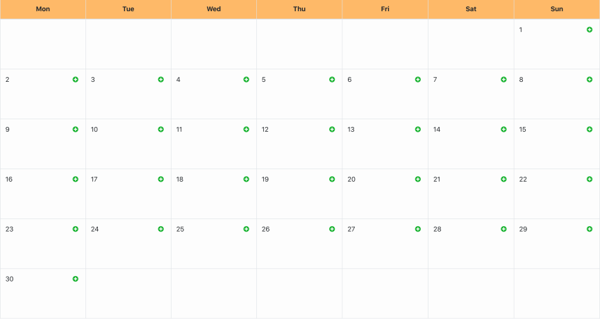

# Event Calendar
I assembled this software using NodeJS to dynamically display a calendar-view of any month in any year listing personal events. For security, I used bcrypt to hash passwords before storing them in the database, and implemented a function to verify a user’s token for authorization.
## Data Models
For the `event` object, I used the following data model:
```javascript
{
    name: string,
    time: string,
    type: string, // options are "Reminder", "Meeting" and "Task"
    date: string,
    completer: bool,
    userId: ObjectId // points to the user who created this event
}
```
For the `user` object, I used the following data model:
```javascript
{
    name: string,
    email: string,
    password: string, // encrypted
    events: [ObjectId] // points to the events created by the user
}
```
## Calendar algorithm
For this project, a user chooses any month in any year. Given their input, I can generate a calendar-view displaying that month. I didn't want to use a pre-built library so I built a function that outputs a cell for each day of the month on its associated weekday.
```javascript
const date = new Date(month);
const firstDay = date.getDay(); // Given the user-selected month, I calculate which day of the week the first day of that month falls on
```
When looking at a calendar, the month can actually spread across six calendar weeks, as shown below for November 2020.  
  
To calculate this, I used one for loop, but tracked two counting variables.
```javascript
let j = 1; // j represents the day of the month
for (let i = 0; i < 42; i++) { // i represents the cell number (42 in total for the months that spread across 6 weeks, 35 for the rest)
    if (j < /* number of days in the chosen month */) {
        if (i === 6) {
            // returns the first calendar week of the month
        } else if (i % 7 === 0 && i < 6) {
            // returns the other calendar weeks of the month
        }
        if (i >= firstDay) { j++ } // this line of code is to know how many of the first cells remain empty
    }
}
```
Following the above operations, a `Week` component is called, which then calls a `Day` component, which returns a populated `<td></td>` or an empty `<td></td>`.
## Security
### Authentication
To access the personalized event calendar, users must create an account. The password is cached using setState while the user is entering their password. Once the user creates an account, the password is then hashed using the `bcryptjs` package.
```javascript
import bcrypt from 'bcryptjs'; // import the package

const salt = bcrypt.genSaltSync(10); // choose the number of salt rounds

const hashedPassword = bcrypt.hashSync(password1, salt); // hash the password before sending it to the API
```
To login, the user inputs their credentials, which is sent to the API to be checked in the database.
```javascript
const body = req.body;
const response = await verifyUser(body.email, body.password); // this function will check credentials and returns false if the credentials didn't match
if (response) { // if the credentials were valid, the user will receive a token verifying their successful login
    const token = await jwt.sign({id: response}, process.env.JWT_KEY);
    res.set('auth', token);
    res.set('Access-Control-Expose-Headers', 'auth');
    res.send();
} else {
    res.status(401).send();
}
```
### Authorization
For users to successfully update their calendar, they need a valid token. If the user selected `Remember me` when logging in or creating their account, their token was cached not only in session storage but also in local storage on the browser. Caching the token in local storage is what allows the user to skip the sign-in process because local storage persists even if the browser has been closed. Upon every http request made to the back-end server, the token is sent to authorize the user and attribute their personal events to their unique account.